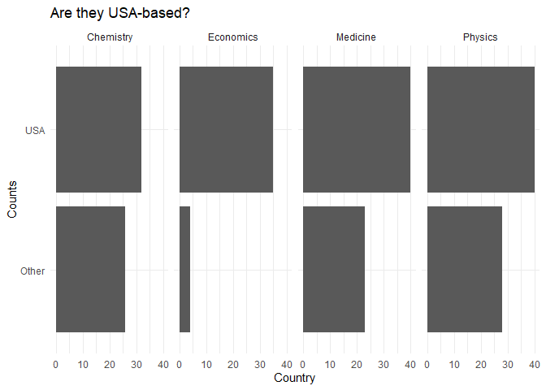
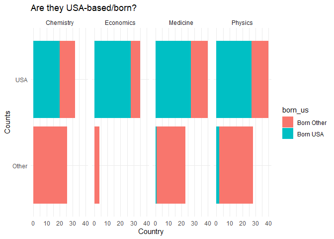

Lab 03 - Nobel laureates
================
Insert your name here
Insert date here

### Load packages and data

``` r
library(tidyverse) 
```

``` r
nobel <- read_csv("data/nobel.csv")
```

## Exercises

### Exercise 1

``` r
dim(nobel)
```

    ## [1] 935  26

### Exercise 2

``` r
nobel_living <- filter(nobel, 
                       !is.na(country),
                       gender != "org",
                       is.na(died_date))
```

``` r
nobel_living <- nobel_living %>%
  mutate(
    country_us = if_else(country == "USA", "USA", "Other")
  )
nobel_living_science <- nobel_living %>%
  filter(category %in% c("Physics", "Medicine", "Chemistry", "Economics"))
```

### Exercise 3

``` r
ggplot(nobel_living_science, aes(y = country_us)) +
  geom_bar() +
  facet_grid(~ category) +
  labs(title = "Are they USA-based?", x = "Country", y = "Counts") +
  theme_minimal()
```

<!-- -->

### Exercise 4

…

``` r
nobel_living <- nobel_living %>%
  mutate(
    born_us = if_else(born_country == "USA", "Born USA", "Born Other")
  )
nobel_living_science_born <- nobel_living %>%
  filter(category %in% c("Physics", "Medicine", "Chemistry", "Economics"))
```

### Exercise 5

…

``` r
ggplot(nobel_living_science_born, aes(y = country_us, fill = born_us)) +
  geom_bar() +
  facet_grid(~ category) +
  labs(title = "Are they USA-based/born?", x = "Country", y = "Counts") +
  theme_minimal()
```

<!-- -->

### Exercise 6

``` r
outsiders <- nobel_living %>%
  filter(born_country != "USA"
  )
count(outsiders, born_country, wt = NULL, sort = TRUE)
```

    ## # A tibble: 33 × 2
    ##    born_country       n
    ##    <chr>          <int>
    ##  1 Germany           20
    ##  2 Japan             17
    ##  3 United Kingdom    16
    ##  4 France             8
    ##  5 Canada             6
    ##  6 China              6
    ##  7 Switzerland        6
    ##  8 Israel             5
    ##  9 Norway             4
    ## 10 Australia          3
    ## # ℹ 23 more rows

…
